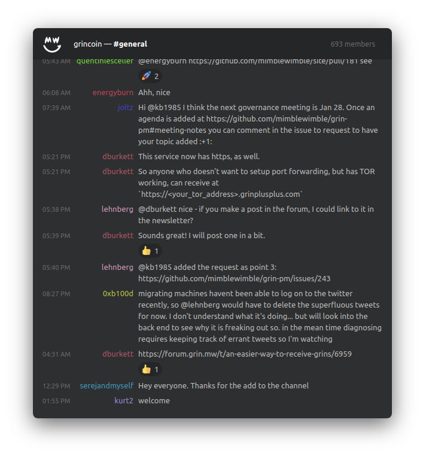

# keybase-chat-widget
A widget for showing Grin's Keybase #general channel on https://grin.mw.

`keybase-chat-widget` uses Keybase's CLI tool to fetch the chat and team data, which is then served from an Express.js server. The front-end is React, bootstrapped with an create-react-app instance which have been ejected.

## License
Apache License v2.0.
